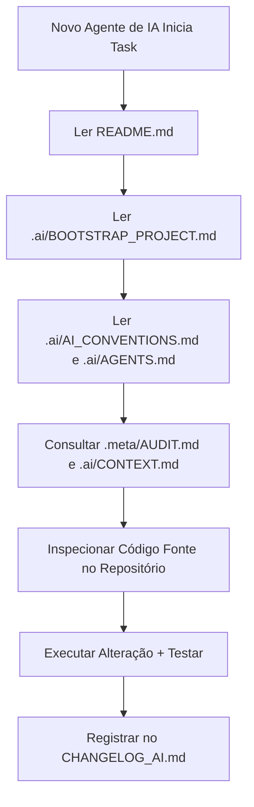

# Diretrizes para Agentes de Inteligência Artificial

Este documento estabelece o guia de comportamento, responsabilidades, restrições, prioridades e compatibilidade para qualquer agente de IA (Antigravity, Claude, ChatGPT, Cursor, Windsurf, Codex, etc.) atuando no repositório **Finflow**.

---

## 1. Responsabilidades

1. **Auditoria Antes da Ação**: Inspecione o arquivo [.meta/AUDIT.md](file:///c:/Users/Dan13/OneDrive/Documentos/Projetos%20dev/Pessoais/Financeiro/.meta/AUDIT.md) e a base de código antes de propor ou aplicar modificações.
2. **Preservação da Integridade**: Nunca altere lógica funcional de produção sem executar a suíte de testes relevante em [tests/](file:///c:/Users/Dan13/OneDrive/Documentos/Projetos%20dev/Pessoais/Financeiro/tests/).
3. **Não Mascarar Sintomas**: Nunca resolva erros silenciando exceções (`try/catch` vazios), apagando testes falhos ou retornando dados fictícios em código de produção.
4. **Isolamento de Dados por Usuário**: Garanta que todo novo endpoint ou consulta EF Core restrinja os dados aplicando o filtro por `UserId` (`ClaimTypes.NameIdentifier`).
5. **Registro de Alterações**: Toda modificação estrutural ou de documentação executada por agentes de IA DEVE ser registrada no log [CHANGELOG_AI.md](file:///c:/Users/Dan13/OneDrive/Documentos/Projetos%20dev/Pessoais/Financeiro/CHANGELOG_AI.md).

---

## 2. Restrições e Proibições

- **Credenciais em Código**: É ESTRITAMENTE PROIBIDO versionar chaves privadas, tokens JWT reais ou conexões de banco reais em `appsettings.json` ou código fonte.
- **Roteamento no Front-end**: Não introduza bibliotecas externas de roteamento (ex: React Router) sem aprovação formal e registro de decisão em [docs/DECISIONS.md](file:///c:/Users/Dan13/OneDrive/Documentos/Projetos%20dev/Pessoais/Financeiro/docs/DECISIONS.md). A aplicação utiliza navegação por estado local (`activeKey`).
- **Inconsistência de Encoding**: Ao alterar o back-end, garanta o uso consistente de `Encoding.UTF8` para manipulação de strings e tokens JWT.
- **Sem Modificação de Interfaces sem Atualizar Invocações**: Se alterar a assinatura de um método em `IFinancialSnapshotService`, atualize todas as chamadas nos controllers afetados.

---

## 3. Prioridades de Atuação

1. **Segurança e Estabilidade**: Resolução de inconsistências de autenticação (ex: encoding de JWT) e isolamento multi-tenant por usuário.
2. **Resiliência e Observabilidade**: Tratamento unificado de erros, timeouts e retries em chamadas externas (como o Tesouro Direto).
3. **Qualidade do Código**: Refatoração progressiva de regras de negócio concentradas nos controllers para serviços encapsulados.
4. **Testes Automatizados**: Manutenção e expansão das suítes de testes em [tests/backend/](file:///c:/Users/Dan13/OneDrive/Documentos/Projetos%20dev/Pessoais/Financeiro/tests/backend/) e [tests/frontend/](file:///c:/Users/Dan13/OneDrive/Documentos/Projetos%20dev/Pessoais/Financeiro/tests/frontend/).

---

## 4. Agent Compatibility

Qualquer agente de IA acessando este repositório DEVE consultar a seguinte estrutura e ordem de leitura para localizar rapidamente as informações:

### Quais documentos ler primeiro (Prioridade de Leitura):
1. [README.md](file:///c:/Users/Dan13/OneDrive/Documentos/Projetos%20dev/Pessoais/Financeiro/README.md) - Visão geral do repositório e mapa da documentação.
2. [.ai/BOOTSTRAP_PROJECT.md](file:///c:/Users/Dan13/OneDrive/Documentos/Projetos%20dev/Pessoais/Financeiro/.ai/BOOTSTRAP_PROJECT.md) - Guia de onboarding e sequência de leitura.
3. [.ai/GOVERNANCE.md](file:///c:/Users/Dan13/OneDrive/Documentos/Projetos%20dev/Pessoais/Financeiro/.ai/GOVERNANCE.md) - Políticas permanentes de código, commits e diretrizes.
4. [.ai/AI_CONVENTIONS.md](file:///c:/Users/Dan13/OneDrive/Documentos/Projetos%20dev/Pessoais/Financeiro/.ai/AI_CONVENTIONS.md) - Manual de operação padrão para IAs neste projeto.

### Como localizar rapidamente qualquer informação:
- **Contexto Funcional**: Consultar [.ai/CONTEXT.md](file:///c:/Users/Dan13/OneDrive/Documentos/Projetos%20dev/Pessoais/Financeiro/.ai/CONTEXT.md).
- **Memória Permanente**: Consultar [.ai/MEMORY.md](file:///c:/Users/Dan13/OneDrive/Documentos/Projetos%20dev/Pessoais/Financeiro/.ai/MEMORY.md).
- **Arquitetura Técnica**: Consultar [docs/ARCHITECTURE.md](file:///c:/Users/Dan13/OneDrive/Documentos/Projetos%20dev/Pessoais/Financeiro/docs/ARCHITECTURE.md).
- **Requisitos Confirmados**: Consultar [docs/SPEC.md](file:///c:/Users/Dan13/OneDrive/Documentos/Projetos%20dev/Pessoais/Financeiro/docs/SPEC.md).
- **Histórico de Decisões (ADRs)**: Consultar [docs/DECISIONS.md](file:///c:/Users/Dan13/OneDrive/Documentos/Projetos%20dev/Pessoais/Financeiro/docs/DECISIONS.md).
- **Padrões de Código**: Consultar [docs/PATTERNS.md](file:///c:/Users/Dan13/OneDrive/Documentos/Projetos%20dev/Pessoais/Financeiro/docs/PATTERNS.md).
- **Exemplos HTTP**: Consultar [docs/EXAMPLES.md](file:///c:/Users/Dan13/OneDrive/Documentos/Projetos%20dev/Pessoais/Financeiro/docs/EXAMPLES.md).
- **Inventário de Arquivos**: Consultar [.meta/INVENTORY.md](file:///c:/Users/Dan13/OneDrive/Documentos/Projetos%20dev/Pessoais/Financeiro/.meta/INVENTORY.md).

### Fluxo recomendado para novos agentes:

---

## Confidence

### Alta
- Regras de restrição de código, isolamento por `UserId` e mapa de compatibilidade de agentes derivados diretamente da estrutura corporativa do repositório.

### Média
- N/A.

### Baixa
- N/A.

## Validação Humana Necessária
- Nenhuma validação manual necessária para este documento.
