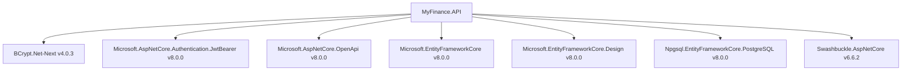

# Finflow - Grafo de Dependências

Este artefato analítico mapeia as dependências internas e externas dos projetos **MyFinance.API** e **MyFinance.Web**.

---

## 1. Dependências do Back-end (.NET 8 - `MyFinance.API.csproj`)



### Provedor de Dados Externos
- `HttpClient` -> Dataset do Tesouro Direto (`https://www.tesourotransparente.gov.br/.../precotaxatesourodireto.csv`).
- `IMemoryCache` -> Caching em memória de 60 minutos para cotações do Tesouro.

---

## 2. Dependências do Front-end (React 18 - `package.json`)

```mermaid
graph TD
    Web[MyFinance.Web] --> React[react v18.3.1]
    Web --> ReactDom[react-dom v18.3.1]
    Web --> Antd[antd v6.0.0]
    Web --> AntdIcons[@ant-design/icons v6.1.0]
    Web --> AntdMobile[antd-mobile v5.41.1]
    Web --> Axios[axios v1.13.2]
    Web --> ChartJS[chart.js v4.5.1]
    Web --> ReactChart[react-chartjs-2 v5.3.1]
    Web --> DayJS[dayjs v1.11.19]
    Web --> StyledComp[styled-components v6.1.19]
    Web --> Vite[vite v7.2.4]
```

---

## 3. Dependências das Suítes de Testes (`tests/`)

```mermaid
graph TD
    LogicTests[Finflow.Api.LogicTests] --> API[MyFinance.API.csproj]
    LogicTests --> InMemory[Microsoft.EntityFrameworkCore.InMemory v8.0.0]
    LogicTests --> xUnit[xunit v2.9.2]

    ContractTests[Finflow.Api.ContractTests] --> xUnit[xunit v2.9.2]
    ContractTests --> APIEndpoint[MyFinance.API Running Server]

    E2ETests[tests/frontend] --> Playwright[@playwright/test v1.54.2]
    E2ETests --> WebServer[MyFinance.Web Running Server]
```

---

## Confidence

### Alta
- Grafo de dependências gerado diretamente pela inspeção de `MyFinance.API.csproj`, `MyFinance.Web/package.json` e dos projetos em `tests/`.

### Média
- N/A.

### Baixa
- N/A.

## Validação Humana Necessária
- Nenhuma validação manual necessária para este documento.
