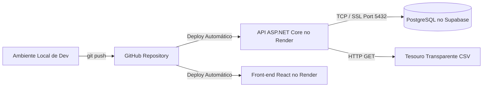

# Finflow - Análise do Workspace e Ambiente

Este artefato analítico apresenta o diagnóstico de ambiente, topologia de hospedagem e saúde técnica do workspace **Finflow**.

---

## 1. Mapeamento dos Ambientes e Infraestrutura

---

## 2. Diagnóstico de Configuração e Variáveis de Ambiente

### Back-end (`MyFinance.API`)
- **Porta de Hospedagem**: Variável de ambiente `PORT` (injetada dinamicamente pelo Render). Fallback local em `10000`.
- **String de Conexão**: Variável `ConnectionStrings__DefaultConnection` (PostgreSQL Supabase).
- **Segredo JWT**: Variável `AppSettings__Token`.
- **Bootstrap de Migrações**: Variável `RunSchemaBootstrap` (controla se `ApplyMigrationsAsync` executa `db.Database.MigrateAsync()`).

### Front-end (`MyFinance.Web`)
- **URL da API**: Variável de ambiente `VITE_API_URL` (injetada no build do Vite com o sufixo `/api`).
- **Servidor Dev Vite**: Porta local `5173`.

---

## 3. Avaliação da Saúde do Repositório

- **Pontos Fortes**:
  - Separação clara entre Web API C# e SPA React.
  - Presença de suítes completas de testes (.NET Logic, .NET Contract e Playwright E2E).
  - Estrutura documental padronizada nas pastas `docs/`, `.ai/` e `.meta/`.
- **Pontos Fracos Diagnosticados**:
  - Inconsistência de encoding JWT entre `Program.cs` e `AuthController.cs`.
  - Corrupção de caracteres em `UsersController.cs` devido ao salvamento em ANSI.
  - Regras de negócio concentradas nos controllers sem camada de serviço dedicada (à exceção do `FinancialSnapshotService`).

---

## Confidence

### Alta
- Análise de workspace derivada do código do `Program.cs`, `api.js` e arquivos de projeto.

### Média
- N/A.

### Baixa
- N/A.

## Validação Humana Necessária
- Nenhuma validação manual necessária para este documento.
