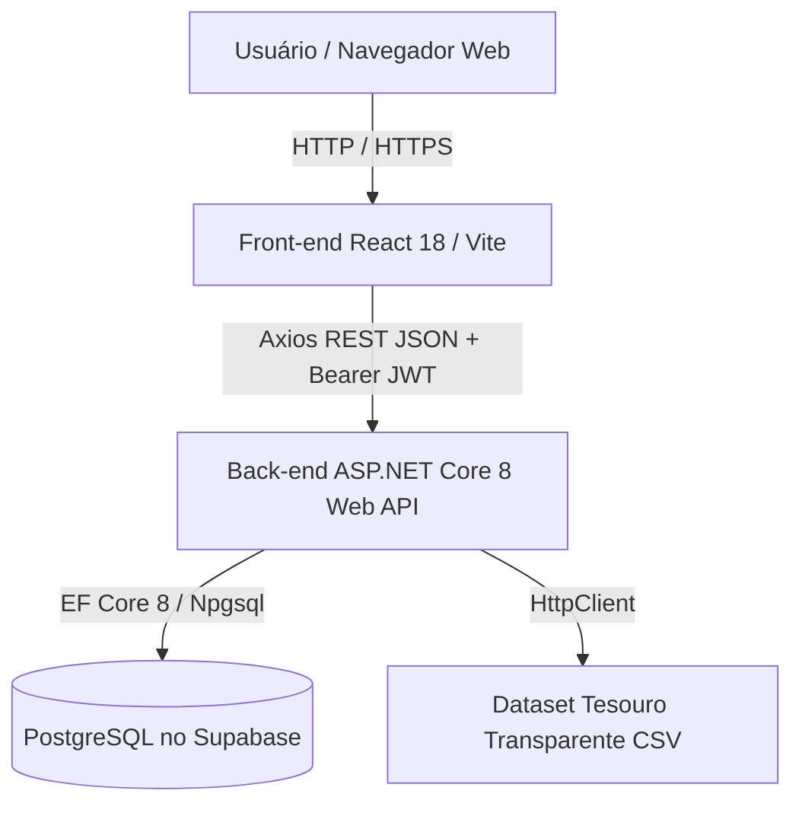
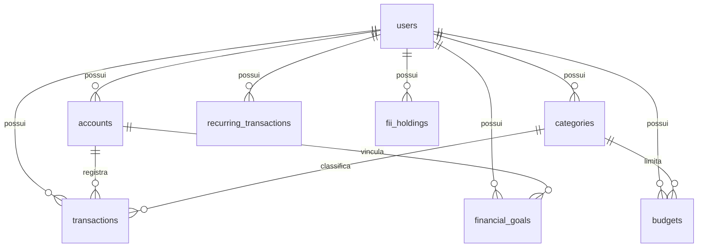
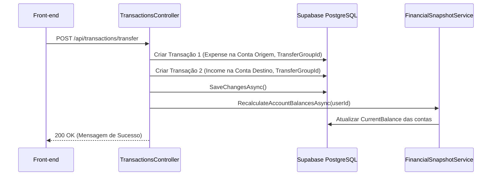

# Finflow - Arquitetura de Software

Este documento descreve a arquitetura detalhada, diagrama de componentes, fluxo de dados, estrutura do banco de dados e padrões de integração do sistema **Finflow**.

---

## 1. Visão Geral da Arquitetura

O Finflow adota a arquitetura de **Aplicação Desacoplada (Decoupled Architecture)** em 3 camadas independentes:

---

## 2. Componentes da Aplicação

### 2.1. Camada de Apresentação (Front-end)
- **Localização**: Folder [MyFinance.Web/](file:///c:/Users/Dan13/OneDrive/Documentos/Projetos%20dev/Pessoais/Financeiro/MyFinance.Web/)
- **Core**: React 18, Vite, JSX.
- **Componentes Globais**:
  - `App.jsx`: Shell da aplicação, menu lateral responsivo e gerenciamento de estado da tela ativa (`activeKey`).
  - `api.js`: Cliente Axios com interceptors de requisição (token JWT) e resposta (erros 401, 403, 500, timeout).
- **Componentes de Domínio**: Páginas em `src/pages/` e Modais em `src/components/`.

### 2.2. Camada de Aplicação e API (Back-end)
- **Localização**: Folder [MyFinance.API/](file:///c:/Users/Dan13/OneDrive/Documentos/Projetos%20dev/Pessoais/Financeiro/MyFinance.API/)
- **Controllers**: 12 Controllers RESTful em [MyFinance.API/Controllers/](file:///c:/Users/Dan13/OneDrive/Documentos/Projetos%20dev/Pessoais/Financeiro/MyFinance.API/Controllers/).
- **Serviços de Domínio**:
  - [FinancialSnapshotService.cs](file:///c:/Users/Dan13/OneDrive/Documentos/Projetos%20dev/Pessoais/Financeiro/MyFinance.API/Services/FinancialSnapshotService.cs): Cálculo desacoplado e reutilizável de snapshots de saldos reais, pendentes, projetados, limites de fatura e projeções de fluxo de caixa.
- **Middlewares**: Autenticação JWT Bearer, tratamento de CORS, Swagger UI, Migrações automáticas no startup via `ApplyMigrationsAsync`.

### 2.3. Camada de Banco de Dados (Persistência)
- **Engine**: PostgreSQL relacional.
- **ORM**: Entity Framework Core 8.
- **Contexto**: [AppDbContext.cs](file:///c:/Users/Dan13/OneDrive/Documentos/Projetos%20dev/Pessoais/Financeiro/MyFinance.API/Data/AppDbContext.cs).
- **Mapeamento de Entidades**:
  - `users`: Usuários do sistema (`User`).
  - `accounts`: Contas bancárias, carteiras de investimento e cartões (`Account`).
  - `categories`: Categorias de receitas e despesas (`Category`).
  - `transactions`: Lançamentos financeiros, parcelas e transferências (`Transaction`).
  - `recurring_transactions`: Regras para despesas/receitas fixas (`RecurringTransaction`).
  - `budgets`: Orçamentos mensais por categoria (`Budget`).
  - `financial_goals`: Metas de economia ou dívidas (`FinancialGoal`).
  - `fii_holdings`: Posições em fundos imobiliários (`FiiHolding`).

---

## 3. Modelo ER de Entidades

---

## 4. Fluxos de Dados Críticos

### 4.1. Fluxo de Transferência entre Contas

---

## Confidence

### Alta
- Arquitetura, diagramas, entidades EF Core e fluxo de chamadas confirmados diretamente inspecionando o código-fonte em C#.

### Média
- N/A.

### Baixa
- N/A.

## Validação Humana Necessária
- Nenhuma validação manual necessária para este documento.
